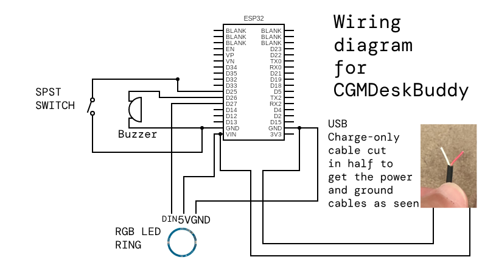
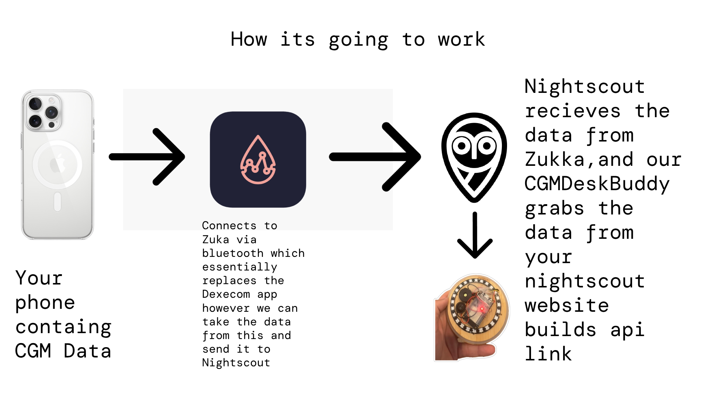

# CGMDeskBuddy (DIY Glowcose Clone)





Build your own bedside CGM light and alarm using an ESP32, WS2812B ring, buzzer and real-time Nightscout data  
**Watch the full build video:** https://youtu.be/f_32VhqJnVs

## Overview

CGMDeskBuddy fetches your latest Dexcom G6 readings from Nightscout, converts mg/dL → mmol/L, drives a 24-LED NeoPixel ring with colour-coded status and sounds buzzer alarms on critical lows or highs—even when you “turn off” the lights with a night-mode switch.

## Features

- Live Nightscout integration (HTTPS fetch + JSON parse)  
- Colour bands + critical flash modes  
  - < 3.5 mmol/L → flashing red + buzzer  
  - 3.5 – 4.0 → orange  
  - 4.0 – 5.0 → yellow  
  - 5.0 – 8.0 → bright green (ideal)  
  - 8.0 – 10.0 → teal  
  - 10.0 – 14.0 → light blue  
  - 14.0 – 18.0 → purple  
  - > 18.0 mmol/L → flashing magenta + buzzer  
- Smooth fade transitions for non-critical ranges  
- Night-mode switch suppresses normal lighting, still allows critical alarms  
- Test mode cycles all bands + alarms without Wi-Fi

## Hardware & Product Links

- **ESP32 DevKit**: https://amzn.eu/d/1BlV0Vw  
- **SPST On/Off Switch**: https://amzn.eu/d/3QDT5co  
- **24-LED NeoPixel Ring**: https://amzn.eu/d/8QFxVEE  
- **Piezo Buzzer**: https://amzn.eu/d/brYPerU  
- **Jar Casing**: https://www.bmstores.co.uk/products/r…  
- **Wire**: any old cable cut in half

## Software & Links

- **Arduino IDE**: https://www.arduino.cc/en/software/  
- **ESP32 Board Definitions**: https://www.silabs.com/developer-tool…  
- **Uptime Robot**: https://uptimerobot.com/  
- **Nightscout Docs**: https://nightscout.github.io/  
- **Zukka App**: https://apps.apple.com/us/app/zukka/i…

## Pinout (ESP32 Left Side)

| Function           | ESP32 Pin | Notes                       |
|--------------------|-----------|-----------------------------|
| NeoPixel data (DI) | GPIO 27   | 3.3 V logic, full I/O       |
| Buzzer             | GPIO 26   | uses `tone()`               |
| Night-mode switch  | GPIO 25   | `INPUT_PULLUP` to GND       |
| NeoPixel VCC       | VIN       | 5 V power                   |
| Ground             | GND       | common ground               |

## Configuration

Open `CGMDeskBuddy.ino` and edit:

```cpp
const char* ssid          = "Your_WiFi_SSID";
const char* password      = "Your_WiFi_Password";
const char* nightscoutURL = "https://your.nightscout.url/api/v1/entries.json?count=1";

#define TEST_MODE      true    // true = demo cycle, false = live data
#define TEST_INTERVAL  2000    // ms between demo cycles
#define LIVE_INTERVAL  60000   // ms between live fetches
